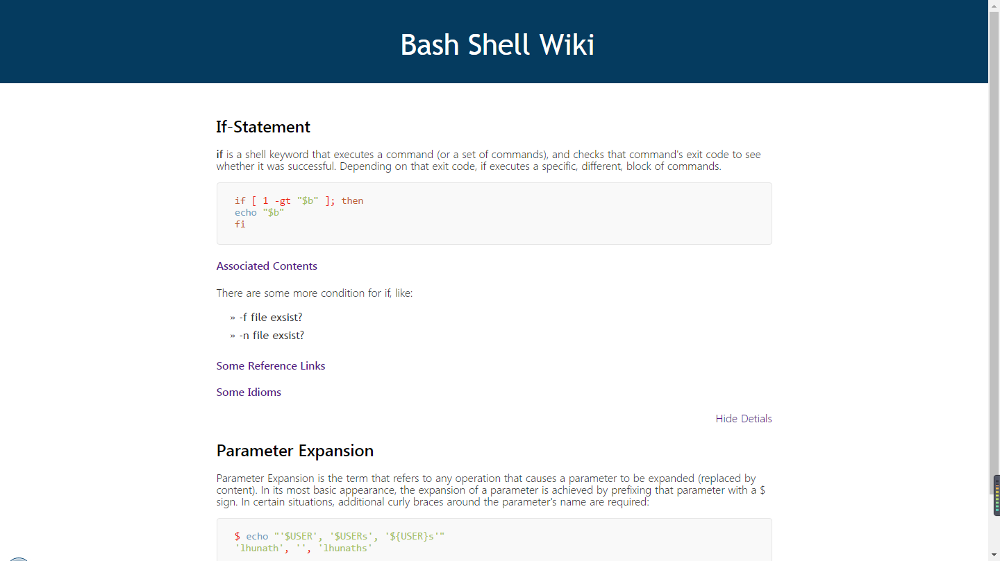

This is my personalwiki system

## ScreenShot

## Introduction

Now we just write the current wiki file, and run the `./generateHtml.sh wikifile` you can get corresponding
wiki html page. and then you can deploy it.

You can get more detial about the wiki file rule in my blog post. Also you can refer the `example`.

That's so easy to write it.

